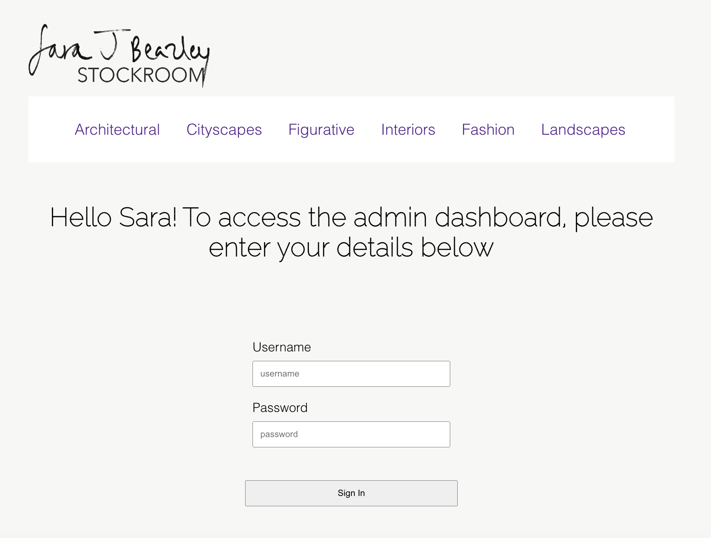
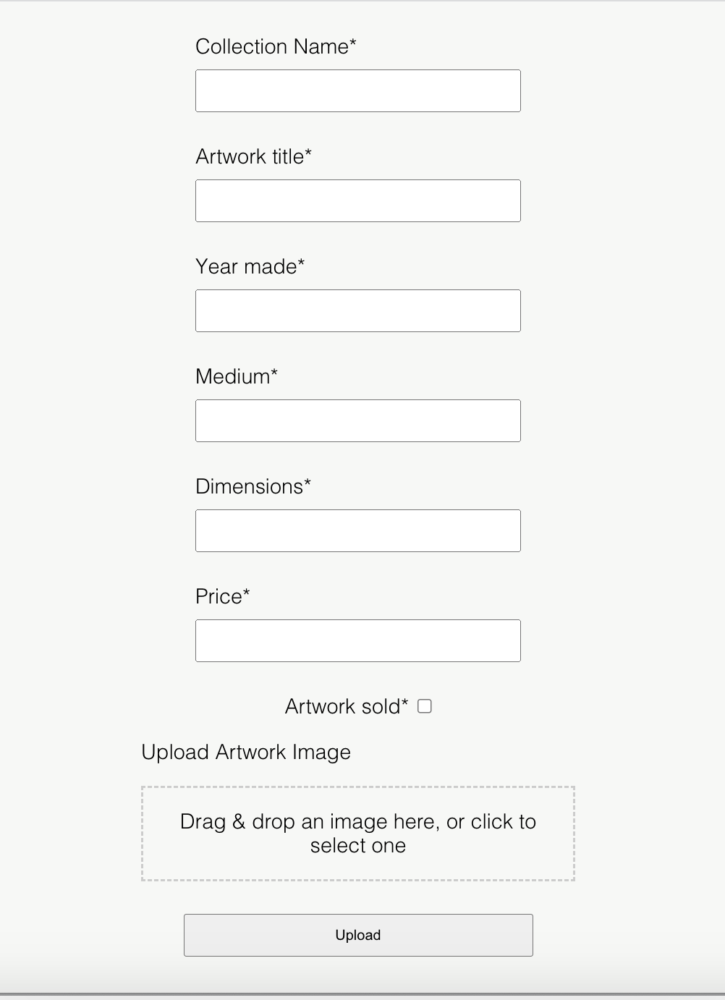
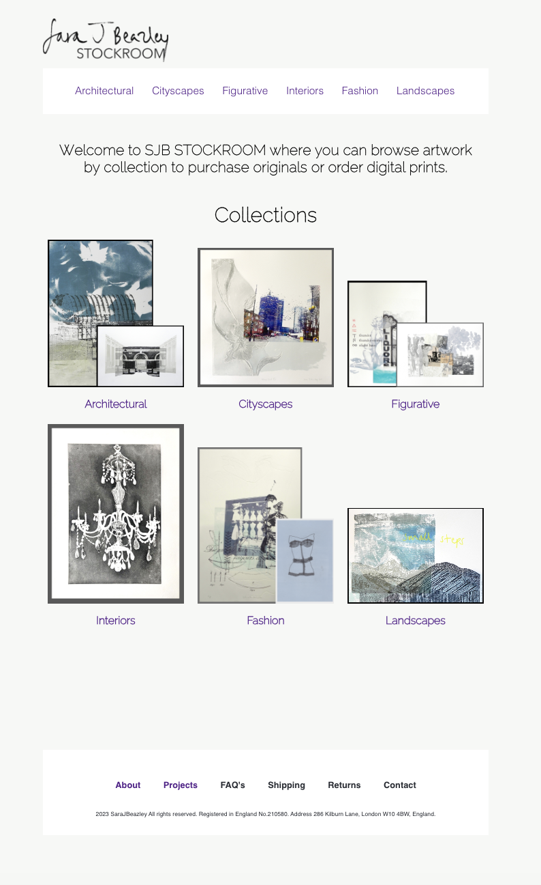
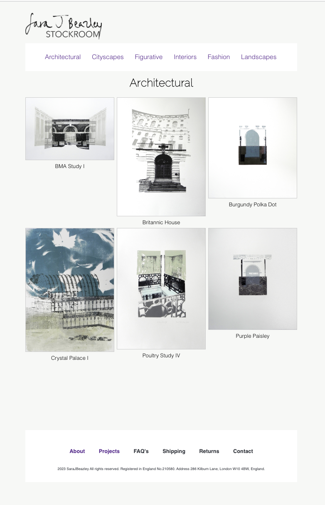
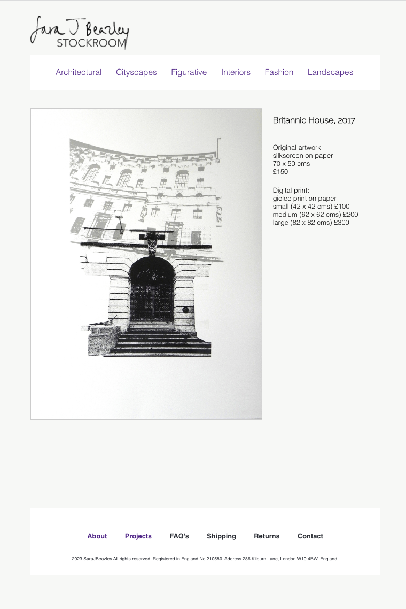

<h1>SJB STOCKROOM</h1> 

A Full stack website built using React, CSS and Node.js, Express, Prisma and PostgreSQL for the backend.

# General Info

This is a solo project created over 2 weeks for my final project at Boolean Tech Academy. The MVP consisted of a Landing Page, a route to 6 different Collections as well as an Admin Login page and an Admin Dashboard.

The website has two main purposes:

* Admin Dashboard: This is where admins can manage the artwork database. They can log in to access the dashboard and upload artwork details along with images. The admin dashboard provides an interface to interact with the backend database.
  
* Gallery: This section is designed for customers and art enthusiasts. It's a place where users can view and eventually purchase artwork. This part of the website is still under development.

## How to view the website:

1.  Open terminal
2.  `git clone https://github.com/sarajbeazley/SJB_Stockroom.git`
3.  `cd SJB_Stockroom`
4.  `npm install`
5.  `npm start`
6.   Open [http://localhost:3000](http://localhost:3000) to view it in your browser.
7.  `npm run server`

To explore the backend functionality and the Admin Dashboard, follow these steps:

* Access via the Login Page:  
  Navigate to <http://localhost:3000/login>
  Here, once logged in with the correct admin credentials you can access the admin dashboard.

  

* Access the Admin Dashboard:
  You can also navigate directly to the admin dashboard using this link <http://localhost:3000/admin>

  

Here, you can currenly upload artwork details and images to the database (image upload still needs to be implemented)

## Next Steps

* Upon upload, images and data will be displayed to the correct page/collection of the website.
* Add E-Commerce

# UI Screenshots

### Landing Page

### Collection Page

### Single Image Page

